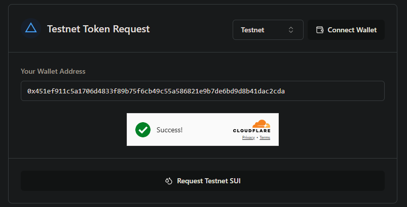

# Configuración del SUI Client

En cualquier blockchain, las redes son entornos en los que los usuarios y desarrolladores pueden interactuar con los contratos inteligentes, validar transacciones o probar funcionalidades nuevas. En el caso de Sui, estas redes permiten separar el entorno de desarrollo del entorno de producción, facilitando tanto la experimentación como la estabilidad del ecosistema. Cada red cumple una función específica y entenderlas es clave para saber en qué momento utilizar cada una según el objetivo: probar, desarrollar o desplegar en producción.

* **Mainnet**: Es la red principal de Sui, donde se ejecutan las transacciones reales y permanentes. Todo lo que sucede aquí tiene valor real —por ejemplo, transferencias de tokens SUI o NFTs—, y está directamente vinculado con dinero o activos que ya están en circulación.
* **Testnet**: Es una red pensada para pruebas controladas antes de lanzar actualizaciones importantes. Su objetivo es garantizar que los cambios no afecten negativamente el rendimiento de la red principal. Los desarrolladores pueden validar sus paquetes y scripts aquí sin correr riesgos económicos.
* **Devnet**: Es un entorno más inestable, pensado para quienes están trabajando con funciones experimentales que todavía no se han integrado oficialmente. Sirve para explorar nuevas capacidades y obtener retroalimentación temprana, aunque no se garantiza su continuidad.
* **Localnet**: Es una red privada que corre localmente en tu computadora. Es ideal para desarrollar y probar sin conexión a internet ni necesidad de depender de otros validadores. Te da control total sobre el entorno y permite iterar más rápidamente.

Estas redes permiten a los desarrolladores preparar, probar y validar sus aplicaciones de forma segura antes de moverlas al entorno real. Para poder interactuar con cualquiera de estas redes, es necesario conectarse a una red a través de la Sui CLI, lo cual implica configurar tu terminal para comunicarse con uno de estos entornos. 

## Configuración inicial

Puedes hacer esto ejecutando los siguientes comandos en tu terminal:
```sh
sui client
```

La primera vez que ejecutemos esto obtendremos el siguiente mensaje:

```sh
Config file ["<PATH-TO-FILE>/client.yaml"] doesn't exist, do you want to connect to a Sui Full node server [y/N]?
```

Presionamos y y luego Enter para continuar y obtendremos esto:
```sh
Sui Full node server URL (Defaults to Sui Testnet if not specified) :
```
Puedes volver a presionar `Enter` en tu teclado para dejar la configuración por defecto, en este caso nos estaríamos conectando a la `testnet`, es decir, a la red de pruebas de Sui. El siguiente mensaje en terminal debería ser algo como:

```sh
Select key scheme to generate keypair (0 for ed25519, 1 for secp256k1, 2 for secp256r1):
```
Puedes seleccionar el que gustes, la opción por defecto es 0, así que escribe `0` en y presiona `Enter`. Una vez terminado deberías obtener algo similar a esto:

```sh
Generated new keypair for address with scheme "ed25519" [0xb9c83a8b40d3263c9ba40d551514fbac1f8c12e98a4005a0dac072d3549c2442]
Secret Recovery Phrase : [cap wheat many line human lazy few solid bored proud speed grocery]
```
> :information_source: Tanto el `address` como la frase de recuperación que obtengas serán diferentes a las que mostramos aquí.


## Fondeando una cuenta

Una vez conectado, el siguiente paso es **fondear tu cuenta**, es decir, asegurarte de que la dirección que estás utilizando tenga **tokens SUI** (aunque sean tokens de prueba) suficientes para cubrir las tarifas de las transacciones. Este proceso es esencial para poder desplegar paquetes, ejecutar funciones y validar tu lógica en cualquier red que estés utilizando.

Puedes hacer esto ejecutando el siguiente comando en tu terminal:

```sh
sui client faucet
```

Obtendrás algo similar a esto, probablemente en letras rojas:

```sh
For testnet tokens, please use the Web UI: https://faucet.sui.io/?address=0x451ef911c5a1706d4833f89b75f6cb49c55a586821e9b7de6bd9d8b41dac2cda
```
Puedes hacer click en esa URL, la cual te llevará al faucet de Sui, que es una aplicación que reparte tokens de prueba en las redes `testnet` y `devnet`, para que los desarrolladores puedan desplegar y probar sus paquetes Move.



Ya en el sitio, simplemente haz click en **Request Testnet SUI**. Con esto habremos terminado el proceso de fondeo. Puedes verificarlo en terminal

```sh
sui client balance
╭────────────────────────────────────────╮
│ Balance of coins owned by this address │
├────────────────────────────────────────┤
│ ╭──────────────────────────────────╮   │
│ │ coin  balance (raw)  balance     │   │
│ ├──────────────────────────────────┤   │
│ │ Sui   10000000000    10.00 SUI   │   │
│ ╰──────────────────────────────────╯ │
╰────────────────────────────────────────╯
```

> :information_source: El README distorsiona un poco este output.

Puedes acceder al faucet directamente desde acá: https://faucet.sui.io/

## Cambiando ambientes

A veces es necesario cambiar el ambiente con el que configuramos inicialmente la CLI. Vamos a agregar el ambiente de `devnet` y cambiarnos a él. Primero es necesario agregarlo a nuestra configuración. Puedes hacerlo de con este comando:

```sh
sui client new-env --alias devnet --rpc https://fullnode.devnet.sui.io:443
```

Ahora, necesitamos cambiarnos a este ambiente. Hazlo de la siguiente manera:
```sh
sui client switch --env devnet 
```

Recuerda que si no tienes tokens es necesario fondear la cuenta. Para `devnet` puedes hacerlo directamente con el comando:
```sh
sui client faucet
```

Puedes consultar tu dirección activa usando:
```sh
sui client active-address
```

Y tu balance usando:
```sh
sui client balance
```

Recuerda que puedes encontrar más comandos del Sui Client en la documentación oficial: https://docs.sui.io/references/cli/client